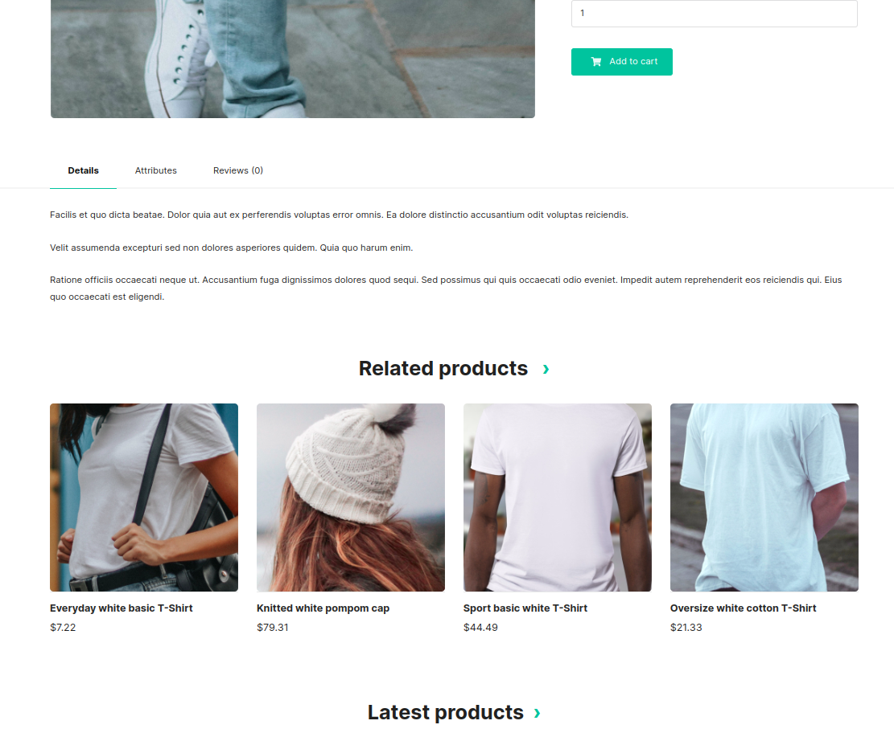

# Functionalities

---
**Related products**

After installation of the plugin, once the customer goes to the product page at `/{_locale}/products/{slug}` they will see a new "Related products" section.

    

Related products are calculated using the following priorities:

#### 1. Order history

- Check product order history. Count the number of orders which contained both the original product and the recommended product. The product with the highest number of common orders is recommended first, then the second one, and so on.
    * Each order counts as 1. The number of items in the order doesn't matter.

#### 2. Common taxons
- If there hadn't been enough common orders to display the requested number of related products, the original product's taxons are checked. Other products that share a taxon are then displayed.
    * Latest products are displayed first.
    * Original product's main taxon is checked first.
    * If there aren't enough other products that use original product's main taxon, original product's other taxons are checked, one after another.

#### 3. Remaining slots
- After the above options are exhausted, no more related products are displayed, even if the list is shorter than requested.

It is also possible to customize this section. The related products section is rendered by `Resources/views/Shop/Product/_relatedProducts.html.twig`. You can override this template to modify it to your needs.
